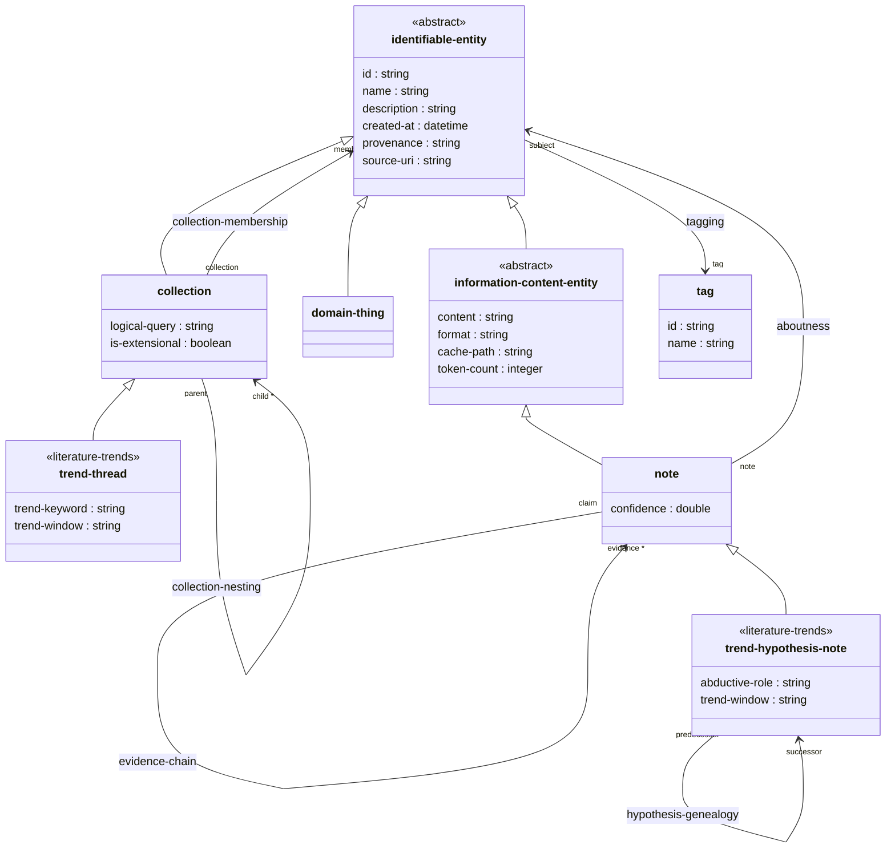
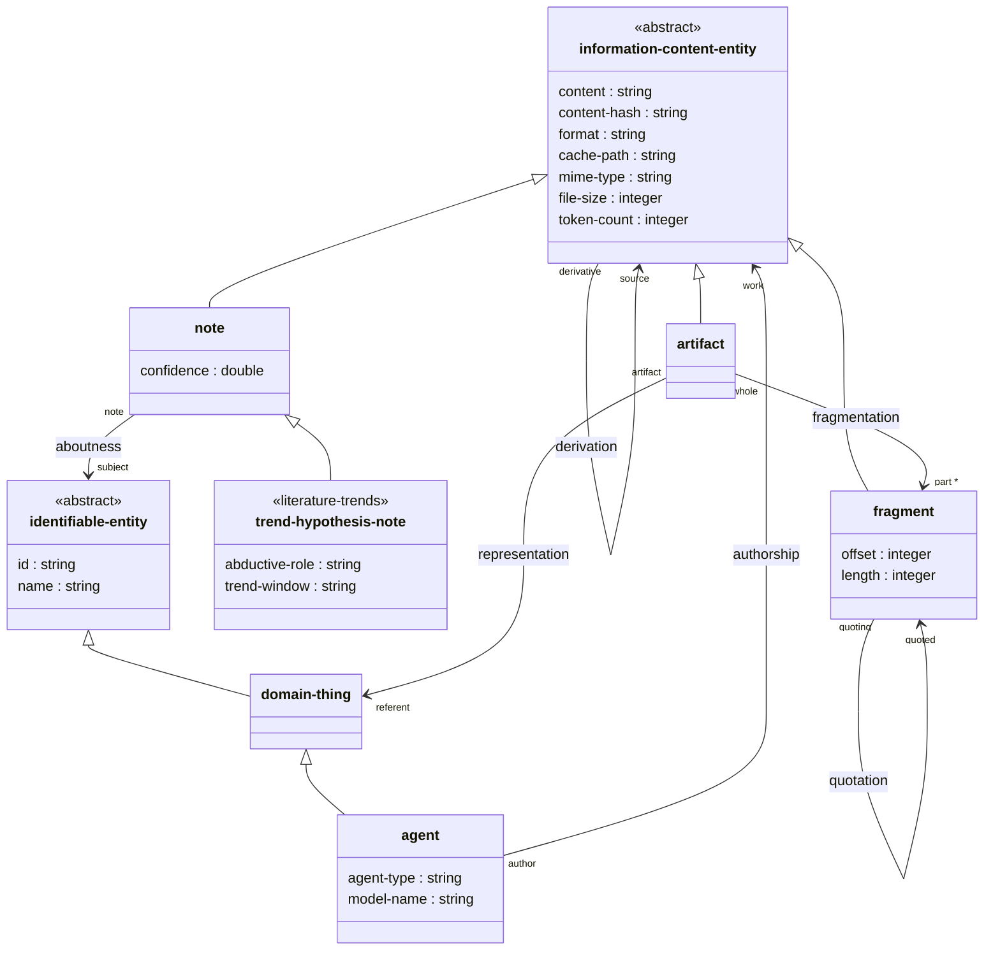

# Literature Trends — Schema Reference

Types marked **`<<literature-trends>>`** are new in this skill.
All other types are inherited from `alhazen_notebook.tql`.

---

## Diagram A — Collections, Entities, Relations, and Notes

The entity type hierarchy rooted at `identifiable-entity`, the two literature-trends
extensions (`trend-thread`, `trend-hypothesis-note`), and the structural relations that
connect them.

### Relation attribute ownership (Diagram A)

| Relation | Roles | Owned attributes |
|---|---|---|
| `collection-membership` | `collection` → `member` | `created-at`, `provenance` |
| `collection-nesting` | `parent-collection` → `child-collection` | — |
| `aboutness` | `note` → `subject` | — |
| `note-threading` | `parent-note` → `child-note` | — |
| `evidence-chain` | `claim` → `evidence` | `confidence`, `evidence-type-attr` |
| `tagging` | `tagged-entity` → `tag` | `created-at`, `provenance` |
| `hypothesis-genealogy` | `predecessor` → `successor` | `genealogy-type`, `confidence`, `provenance`, `description` |

> **`hypothesis-genealogy`** is the only entirely new relation type in this skill.
> All other relations are defined in `alhazen_notebook.tql` and reused here.

---

## Diagram B — Artifacts, Fragments, and Connected Notes

The `information-content-entity` branch and the relations that define the
content capture pipeline: how artifacts are acquired from external sources,
decomposed into fragments, and annotated with notes.

### Relation summary (Diagram B)

| Relation | Roles | Description |
|---|---|---|
| `representation` | `artifact` → `referent` | Links a captured artifact to the domain-thing it represents |
| `fragmentation` | `whole` → `part` | Decomposes an artifact into fragments |
| `quotation` | `quoting-fragment` → `quoted-fragment` | Cross-reference between fragments |
| `derivation` | `derivative` → `derived-from-source` | Provenance chain for derived content |
| `authorship` | `author` → `work` | Attribution of any ICE to an agent or author |
| `aboutness` | `note` → `subject` | Connects a note to any identifiable entity |

---

## Position of `trend-hypothesis-note` across both diagrams

`trend-hypothesis-note` inherits from `note` → `information-content-entity` → `identifiable-entity`,
placing it in both diagrams simultaneously:

**In Diagram A (collections / notes context):**
- Stored in a `trend-thread` collection via `collection-membership`
- Linked to a source paper collection via `aboutness`
- Chained to predecessor/successor hypotheses via `hypothesis-genealogy`
- Can be threaded with follow-up notes via `note-threading`
- Supported by evidence notes via `evidence-chain`

**In Diagram B (artifacts / fragments context):**
- Inherits `content`, `format`, `cache-path`, `token-count` from `information-content-entity`
- Can be traced back to source artifacts via `derivation`
- Can be attributed to an agent (Claude) via `authorship`

The `abductive-role` and `trend-window` attributes are the only additions this skill makes
to the `note` type; everything else is inherited or reused from the base schema.
