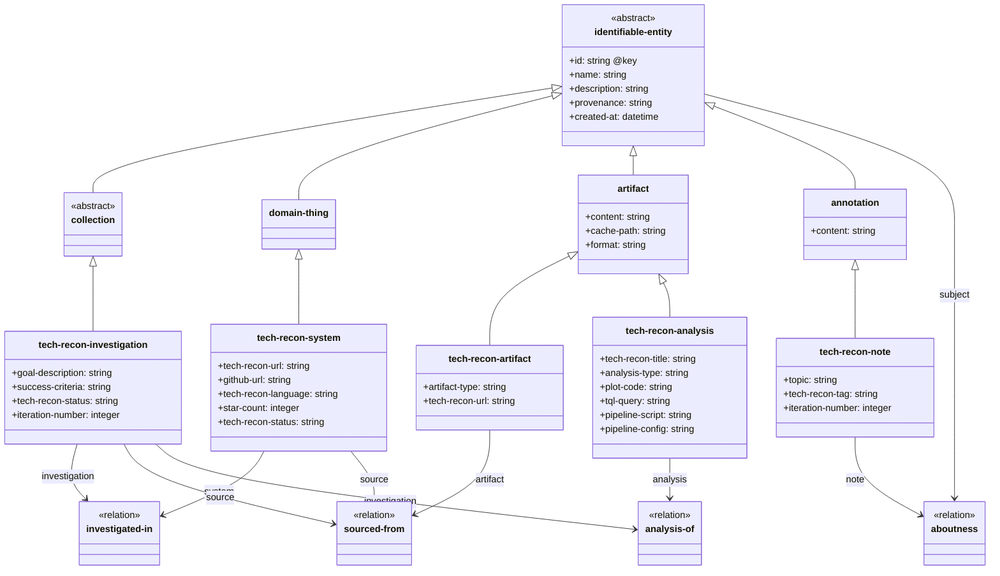

# Tech-Recon Schema

Goal-driven technology investigation skill. A tech-recon investigation organizes systems, artifacts, notes, and analyses into a structured knowledge graph.

## Schema UML

> `annotation` above represents the TypeDB `note` base type (renamed to avoid a Mermaid parser conflict — `note` is a reserved keyword and cannot appear anywhere in a class identifier).
